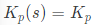

# PI 제어를 통한 Oil Pump Speed Control

## 1. 제어

### On-Off 제어

그냥 켰다 끄는 제어이다. 가장 간단한 피드백제어로 너무나 단순하고 간단한 이 제어까지가 우리가 일상적으로 볼 수 있는 제어 방식이다. 예를 들면 현관 등에서 사람이 지나가면(입력) 불을 켜고(출력) 입력변화가 없으면(입력) 불을 끈다(출력). 기본적인 온도제어도 다 이런 방식이다. 히터의 경우 기준보다 추우면(입력) 켜고(출력) 더우면(입력) 끈다(출력)


### PID 계열

PID제어는 시스템의 정보가 필요없는 컨트롤러 기반 제어기법이다. 별도의 시스템에 대한 해석 없이도 경험적으로 제어기를 조절하여 적당한 작동을 하면 바로 사용할 수 있을 만큼 간편하기 때문에 실제 공학분야에서 가장 많이 쓰이는 제어 방법이며, 로봇이 있는 자동화된 공장이 대표적 사용 사례지만, 드론 조종이나 엘리베이터의 고저차 조절등 실생활에서 의외로 흔히 접할 수 있는편. 사실 PID만 해도 상당히 고급제어이고 이 이상 가는 이론의 경우는 실제 산업이나 공정 제어분야에서도 잘 사용하지 않기 때문에 접할 기회는 많지 않다. 다만 요즘 차량의 크루즈 컨트롤 중 고급 사양에는 쓰이고 있는 듯 하다. 


1. P 제어

   Proportional 제어 (비례 제어)

   

   간단하게 설명하자면 목표와 지금 상태의 차이가 나는 만큼 제어입력을 넣는 것이다.

   난방을 예로 들면 10도 에서 20도로 가열할 때 10에 해당하는 가열을 하고 만약에 15도에서 20도 가열할 때는 5에 해당하는 가열을 하는 것이다. 이 방법의 단점은 차이가 적어지면 적어질수록 20도로 가는 것이 어렵고 심지어는 영원히 도달하지 않을 수 있다.

   만약 가열하는데 옆에 제어 1단위의 냉방기가 있다면[[7\]](https://namu.wiki/w/제어#fn-7) 19도에서 1단위의 난방을 해도 결과적으로 입력은 0인지라 19도에 수렴한다. 사실상 제어에 있어 이런 경우가 대부분이라 정밀제어에서는 P제어만을 사용하지 않는다. 하지만 오차에 민감하지 않은 경우 가장 기본적인 피드백 제어 방법으로 이러한 제어로도 충분하다.

   가장 큰 단점은 steady-state error가 발생한다는 것으로, Transfer function에 Final value Theorem을 적용해보는 것으로 확인할 수 있다. unit step function input일 때를 생각해보면 Kp value를 무한에 도달시켜야만 steady-state error가 사라진다.

   

2. PI 제어

   Proportional Integral 제어 (비례 적분 제어)

   

   앞서 말한 P제어의 한계 극복을 위해 등장한 방법이다. 이 방법은 오차를 적분해 나가는 방법이다.

   앞서 예에서 19도에서 유지되는 경우 1단위의 제어를 시간에 따라서 계속 더해주게 된다. 그러면 결과적으로 제어 입력이 증가하여 이러한 어떠한 외부 환경에 대해서도 일정하게 유지하게 한다. 하지만 이 방법에서도 문제점이 있다.

   앞서 19도의 상황에서 3번 제어를 거쳐 19, 19.5, 19.8, 20도에 도달했다 하자. 이 때 I 제어에서는 1, 0.5, 0.2 를 더한 1.7의 단위의 난방을 한다. 이 멍청한 제어기는 20이 넘어가도 멈추질 않는다! 넘어가서 20.3 도가 되고 나서야 제어입력의 0.3을 깎아서 1.4가 된다. 결국은 이렇게 감소를 반복하여 냉각에 가기까지 출렁이면서 20도에 이르게 된다는 치명적인 단점이 있다. 게다가 이 입력에 대한 가중치가 과하다면 점점 증폭하여 폭주(제어에서는 발산이라 한다)하게 된다는 점을 잘 생각해야 한다.

   

3. PD 제어

   Proportional Derivative 제어 (비례 미분 제어)

   

   폭주하는 제어를 잠재우기 위한 미분제어다. 예를 들어 미친듯이 입력값을 높여서 온도가 -10도에서 한번에 10도로 한번에 +20도가 올라갔다고 하자. 그러면 다음 결과는 30도가 될 것이라 생각할 수 있다. 이런 상황을 방지하기 위해서는 이런 20도가 증가했다는 사실에 대해 -10정도에 해당하는 입력을 빼주어야 한다. 대부분의 시스템은 관성이라는 개념이 존재한다.[[8\]](https://namu.wiki/w/제어#fn-8) 따라서 미리 입력을 줄여놓아야 정확하고 빠른 제어가 가능하다. 하지만 제어가 느려진다는 단점도 있다. 목표치에 도달할 때 좀 더 스무스하게 도착하도록 하는 대신에 제어 성능이 좀 느려지는 경향이 있다. 하지만 이러한 제어를 하는 이유는 시스템의 상태가 좀더 안정적으로 수렴한다는 데 있다.

   전자공학 시스템에서는 신호의 Overshoot을 억제하여 제어의 안정성을 높인다.

   

4. PID 제어

   

   위 세가지 제어를 이용하여 일반적으로 PI 제어, PD제어, IP제어 PID 제어를 쓰게 되는데 어딘가 모자란 P 제어를 I 제어가 보충해주고 이 폭주기관차 I 제어를 D 제어가 억누르는 개념이다.

   이 세 가지를 보통은 경험적으로 이것도 해보고 저것도 해보면서 적당한 값을 찾아 쓰면 된다. 일반적으로 P를 최대한 높여 시스템이 발광하기 직전에서 일정치를 빼고 마찬가지로 I 제어를 최대한 높여 시스템이 발광하기 시작하면 D 제어를 추가하여 발광하기 직전으로 튜닝을 해보자. 그러면 그럭저럭 쓸만한 녀석이 탄생한다.

   다들 튜닝에 어려움을 많이 겪는데 이를 결정할 이론적인 방법이 있다!! (Ziggler Nichols 방법) 하지만 기대하지 말자. 세상에 저 방법으로 제어가 될 시스템이면 제어에 고민할 필요가 없다.

## 2. SW 요구사항

1. 변속기 오일 온도가 120도씨 이상 올라가면
   - 고온 경고상태
   - 200ms 안에 경고등 점등
2. 고온 경고상태
   - 오일펌프의 목표속도를 1500RPM으로 송신
   - 현재 속도 확인
   - 500ms 안에 속도가 제어됨을 확인

* 주어지지않은 정보는 가정하여 고려


## 3. Code

```python
def TM():
    global is_warning_state
    if temp >= 120:
        is_warning_state = True
        return True
    else:
        return False


def OPU(signal):
    global OP_speed
    global PI

    PI += signal - OP_speed
    OP_speed += PI

    return True


def LED(signal):
    global is_LED_ON

    if signal == True:
        is_LED_ON = True

    return True


temp = 150
is_LED_ON = False
is_warning_state = False
OP_speed = 2000
PI = 0
time = 1


while time < 500:
    if TM():
        LED(True)
        while OP_speed != 1500:
            OPU(1500)

    time += 1

```

