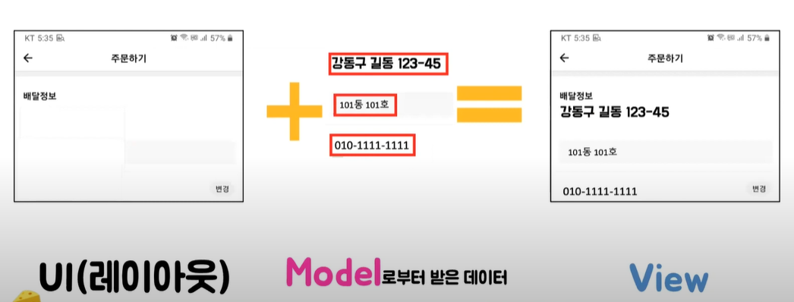

# MVC Pattern

## MVC Pattern
MVC는 Model-View-Controller의 약자이다.

개발할 때 Model, View, Controller로 구분하여 개발하는 소프트웨어 개발 방법론이다.
각각의 구분된 요소를 살펴보면,

- Model은 **무엇을 할지 정의**. 알고리즘, 데이터 등의 기능을 처리.
- Controller는 **어떻게 할지를 정의**. 요청을 받아서 화면과 Model과 View를 연결시켜주는 역할.
- View는 **무엇을 화면으로 보여주는 역할**. 웹페이지, 어플의 화면 처럼 보여지는 부분.

## Rule

- Model은 Controller와 View에 의존해서는 안된다. (Model 내부에 Controller와 View에 관련된 코드가 있으면 안된다.)
- View는 Model에만 의존해야한다. (Controller에는 의존해서는 안됨)
- View가 Model로부터 데이터를 받을 때는, 사용자 마다 다르게 보여주어야 하는 데이터에 대해서만 받아야 한다.
- Controller는 Model과 View에 의존해도 된다.
- View가 Model로부터 데이터를 받을 때, 반드시 Controller에서 받아야 한다.

## 한계

MVC에서 View는 Controller에 연결되어 화면을 구성하는 단위요소이므로 다수의 View들을 가질 수 있다. 그리고 Model은 Controller를 통해서 View와 연결되어지지만, Controller를 통해서 하나의 View에 연결될 수 있는 Model도 여러개가 될 수 있다. 뷰와 모델이 서로 의존성을 띄게 된다는 것이다. 즉, 화면에 복잡한 화면과 데이터의 구성 필요한 구성이라면, Controller에 다수의 Model과 View가 복잡하게 연결되어 있는 상황이다.

Controller가 너무 복잡하고 비대해져서, 새 기능을 추가할때마다 크고 작은 문제점을 가지고 소드 분석이나 테스트도 어렵다. 이런 형태의 MVC를 Massive ViewController라고 부르며 MVC의 한계를 표현한 용어이다.

