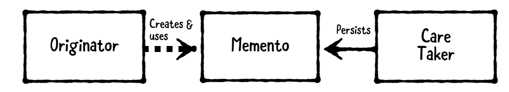
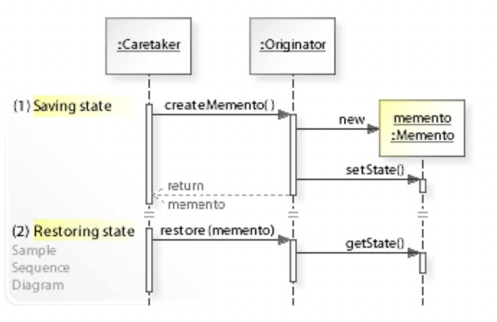

# MementoPattern

객체를 저장하고 복구할 수 있도록 하는 패턴.

## 구성

세 가지로 구성: 오리지네이터(Orignator), 케어테이커(Caretaker), 메멘토(Memento)

[](https://user-images.githubusercontent.com/53814741/165735183-74aa531d-67b3-4706-bef0-f8b829386355.png)

### 오리지네이터

- 저장되거나 복구할 객체
- State를 갖는 객체

다음과 같은 책임을 갖는다.

- 메멘토에 내부 State를 저장
- 메멘토로부터 이전 State 복구

### 메멘토

저장된 State를 나타냄

### 케어테이커 (Caretaker)

오리지네이터에게 저장을 요청하고 응답으로 메멘토를 받는다. 이 메멘토를 보존해야하는 책임이 있고 나중에 오리지네이터에 다시 돌려주어 상태를 복구 시킨다.

1. 먼저 오리지네이터에게 메멘토 객체를 요청. (내부State 저장)
2. 그 뒤 일렬의 명령을 수행
3. 원래 상태로 되돌리기 위해 메멘토 객체를 오리지네이터에 리턴 (이전 State 복구)

## 장점

잘 디자인 된 패턴은 캡슐화된 형태를 갖기 때문에 외부에서 접근이 어려우나 메멘토 패턴을 쓰면 캡슐화를 훼손하지 않고 오리지네이터의 State를 변경하고 복구할 수 있다.

## 언제 써야 하는가?

어떤 객체 상태를 저장했다가 복구해야하는 경우에 적합.

e.g., 게임을 저장하는 시스템 - 오리지네이터가 게임상태(레벨, 체력 등), 메멘토가 저장된 데이터, 케어테이커는 게임시스템

<details style="box-sizing: border-box; display: block; margin-top: 0px; margin-bottom: 16px; color: rgb(36, 41, 47); font-family: -apple-system, BlinkMacSystemFont, &quot;Segoe UI&quot;, Helvetica, Arial, sans-serif, &quot;Apple Color Emoji&quot;, &quot;Segoe UI Emoji&quot;; font-size: 16px; font-style: normal; font-variant-ligatures: normal; font-variant-caps: normal; font-weight: 400; letter-spacing: normal; orphans: 2; text-align: start; text-indent: 0px; text-transform: none; white-space: normal; widows: 2; word-spacing: 0px; -webkit-text-stroke-width: 0px; background-color: rgb(255, 255, 255); text-decoration-thickness: initial; text-decoration-style: initial; text-decoration-color: initial;"></details>

메멘토를 배열로 보관할 수 있음. 이전 상태들을 단계별로 저장. IDE에서 뒤로가기, 앞으로가기 등에 쓰기 좋음.

## 시퀀스 다이어그램

[](https://user-images.githubusercontent.com/53814741/165734308-c2f53ea4-70a1-4b99-adcd-3293119e9851.png)

## 예시

### 메멘토

```python
class Memento(object):
    def __init__(self, state):
        self._state = state
        
    def get_saved_state(self):
        return self._state
```

### 오리지네이터

```python
class Originator(object):
    _state = ""
    
    def set(self, state):
        print("Originator: Setting state to", state)
        self._state = state
        
    def save_to_memento(self):
        print("Originator: Saving to Memento.")
        return Memento(self._state)
        
    def restore_from_memento(self, memento):
        self._state = memento.get_saved_state()
        print("Originator: State after restoring from Memento:", self._state)
```

### 케어테이커

```python
saved_states = []
originator = Originator()
originator.set("State1")

originator.set("State2")
saved_states.append(originator.save_to_memento())

originator.set("State3")
saved_states.append(originator.save_to_memento())

originator.set("State4")
originator.restore_from_memento(saved_states[0])
```

