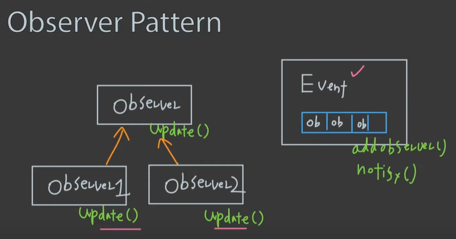
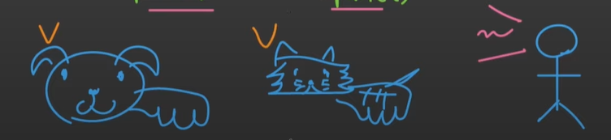

# ObserverPattern

## ObserverPattern(감시자 패턴)

### Observer란 무엇인가?

Event가 일어나는지 바라보고 감시하는 녀석들

Subscriber, Listener 라고 불리기도 한다.


### Polling

주기적으로(1초, 1분, 1시간) 혹은 순번으로 Event가 있는지 없는지를 하는 것

문제점:

- 필요없는 리소스 단계가 생기기도 한다.

- Polling Interval 주기/순번 내에 Event가 발생했다가 사라지면 Event를 감지 할 수 없다.

이러한 문제점들을 해결해 주는 것이 바로 ObserverPatteran이다.


### ObserverPattern이란 무엇인가?

감시자(Observer)들이  한 곳을 계속해서 바라보고 있다가, 그곳에서 어떠한 이벤트가 일어났을 때, Event를 바라보고 있던 감시자들이 바로 반응 할 수 있는 패턴이다.

#### ObserverPattern의 예시

- 아침에 알람이 울리면, 가족 구성원들이 모두 일어나 침구를 정리하고 아침 식사를 준비한다.
- 택배가 도착하면, 재빨리 현관문 앞으로 달려간다.
- GUI 프로그램에서 버튼을 클릭하면, 관련 함수들이 동작한다.
- **이벤트가 발생하면, 옵저버들이 반응한다.**


#### ObserverPattern의 구조




#### 강아지 고양이 주인 예시




#### Code

```python
class Observer:
  def update(self):
    pass

class Cat(Observer):
  def update(self):
    print('meow')

class Dog(Observer):
  def update(self):
    print('bark')
```

```python
class Owner:
  def __init__(self):
    self.animals = []
  def register(self,animal:Observer):
    self.animals.append(animal)
  
  def notify(self):
    for animal in self.animals:
      animal.update()
```

```python
owner = Owner()
cat = Cat()
dog = Dog()

owner.register(cat)
owner.register(dog)

owner.notify()

#출력
#meow
#bark
```

register, notify 에 여러 함수 argument를 추가하기도 하고
notify update 함수가 여러 가지 인 경우도 있다.

Observer를 바라보고 있는 또 다른 Observer를 만들기도 한다.