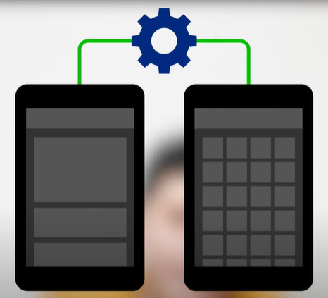
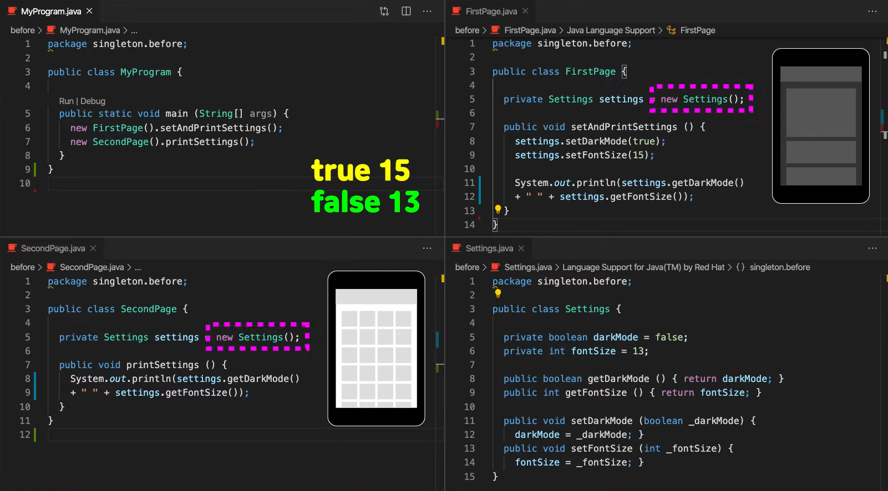
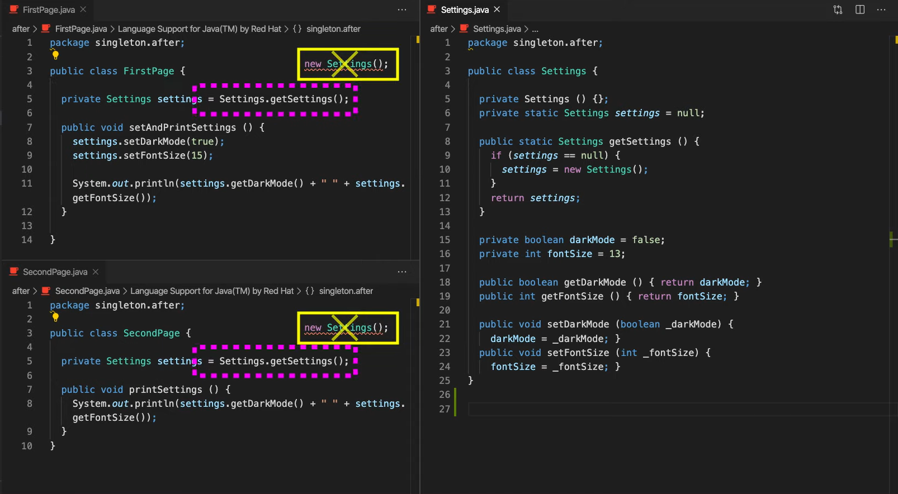

# SingletonPattern

## SingletonPattern

### SingletonPattern이란 무엇인가?

- class의 instance가 딱 1개만 생성되는 것을 보장하는 design pattern.
- 그래서 객체 instance를 2개 이상 생성하지 못하도록 막아야 한다.
- private 생성자를 사용해서 외부에서 임의로 새로운 키워드를 사용하지 못하도록 막아야 한다

### 예시

**다크모드**

세텡에서 다크모드를 설정해놓으면 다른 페이지로 이동하더라도 다크모드가 그대로 유지되어 있어야 한다. 어떤 페이지에 있든 이 세팅을 관리하는 객체는 반드시 같은 것을 사용해야 한다. 즉, 이 객체는 하나만 만들어지도록 해야한다는 것이다.

**SingletonPattern을 사용하지 않았을 때**

**SingletonPattern을 사용했을 때**

페이지를 몇개를 만들든 세팅에 대한 걱정은 하지 않아도 된다.

Q) 그냥 정적 변수들을 쓰지 왜 SingletonPattern을 쓸까?

ans) interface의 사용이나 lazy loading 등 SingletonPattern으로 할 수 있는 것들이 더 많기 때문에 사용한다.

하지만 이렇게만 사용하면 multi thread 환경 등에서 오류가 발생할 소지가 있다. 그래서 SingletonPattern을 보다 안전하게 사용할 수 있는 방법이 언어마다 있다.

ex) JS의 경우 Spring Container

- Spring Container는 Singleton 패턴을 적용하지 않아도, 객체 instance를 Singleton으로 관리한다.

## SingletonPattern의 주의점과 단점

### 주의점

- 무상태(Stateless)로 설계해야 한다.
- 특정 클라이언트에 의존적인 필드가 있으면 안된다.
- 특정 클라이언트가 값을 변경할 수 있는 필드가 있으면 안된다.
- 가급적 읽기만 가능해야 한다.

### 단점

- SingletonPattern을 구현하는 코드 자체가 많이 들어간다.
- test가 어렵다.
- 내부 속성을 변경하거나 초기화 하기 어렵다.
- private 생성자로 자식 class를 만들기 어렵다.
- 유연성이 떨어진다.

