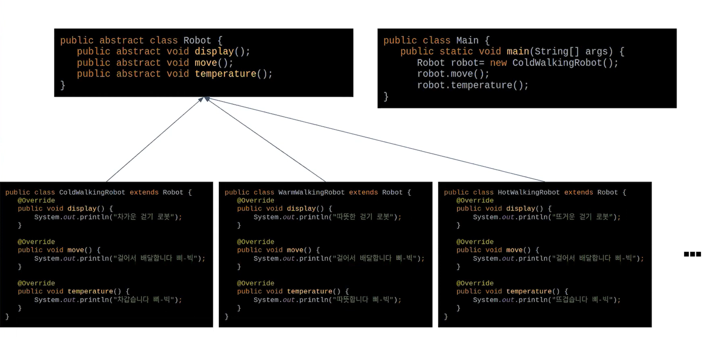
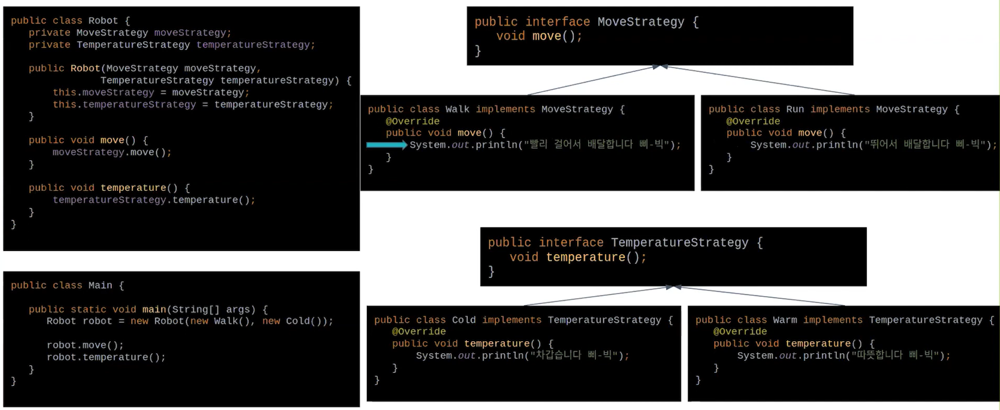
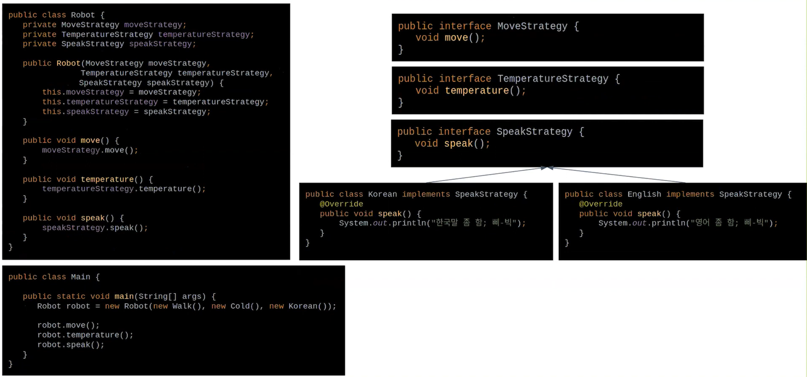
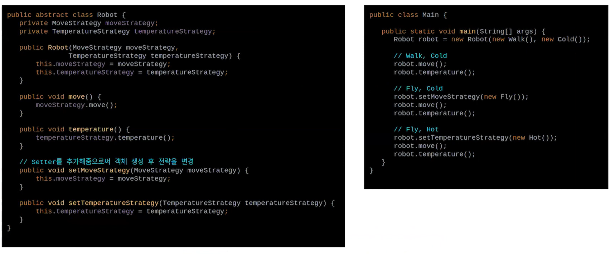
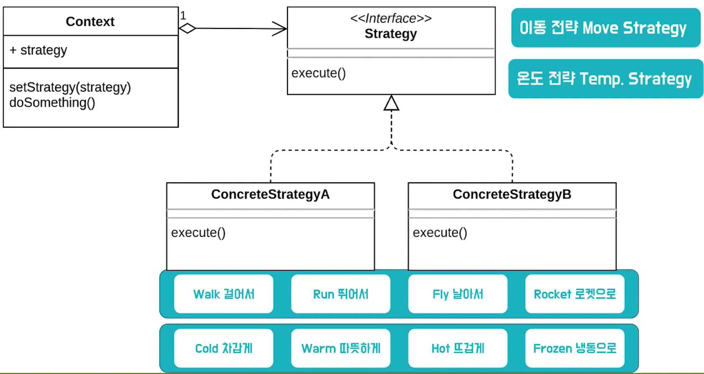

# StrategyPattern

## StrategyPattern

### Strategy(전략)이란 무엇인가?

특정한 목표를 수행하기 위한 행동 계획

### StrategyPattern(전략 패턴)이란 무엇인가?

객체가 할 수 있는 **행위**들 각각들 **전략**으로 만들어 놓고 사용하며, 동적으로 **전략 수정**이 가능한 디자인 패턴

### StrategyPattern(전략 패턴)의 의도

- 동일 계열의 알고리즘군을 정의하고. 

  (walk, runm fly, rocket)

- 각 알고리즘을 캡슐화아며,

  (Move Strategy)

- 이들을 **상호 교환**이 가능하도록 만든다.

## StrategyPattern(전략 패턴) 시나리오 예시

#### 배달의 민족 배달 로봇

##### 상속을 이용한 로봇 설계

> 문제점1. Method 수정이 어렵다.
>
> 문제점2. 새로운 기능의 추가가 어렵다. (ex. 말하기)

##### 전략을 분리하라

Method 수정 편리 ('걸어서'를 '빨리 걸어서'로 수정)

새로운 기능의 추가의 편리(말하기 기능 추가)

#### 상호 교환의 기능 추가

#### StrategyPattern(전략 패턴) UML

## StrategyPattern(전략 패턴)의 장단점

### 장점

- 상속을 사용하지 않음
- if문을 제거할 수 있음
- 구현의 선택이 가능함

### 단점

- 객체수 증가
- 서로 다른 전략을 이해해야 함

## 전략 패턴 vs 상태 패턴

#### 공통점

- 인터페이스를 사용하여 콘크리트 클래스를 캡슐화 한다. (구조가 같다)
- 컨텍스트 클래스는 영향을 받지 않고 변경에 유연한 대처가 가능하다. (둘 다 OCP를 따른다)

#### 차이점

|                                             | 전략 패턴                                     | 상태 패턴                                                    |
| ------------------------------------------- | --------------------------------------------- | ------------------------------------------------------------ |
| 어떤 콘트리트 클래르를 사용할지 결하는 주체 | 클라이언트 혹은 사용자에 의해 전략을 주입받음 | 컨텍스트 스스로 상태를 변환할 수 있음                        |
| 어떤 걸 캡슐화 하는가?                      | 어떻게 객체가 일을 할지, 즉 알고리즘을 캡슐화 | 상태에 따른 행동을 캡슐화                                    |
| 범위                                        | 하나의 특정 작업만 처리                       | 컨텍스트 객체가 수행하는 대부분의 메서드에 대한 인터페이스가 제공 됨 |
| 언제 유용한가?                              | 원하는 알고리즘으로 언제든지 변경하고 싶을 때 | 상태 변화가 잦은 경우                                        |

