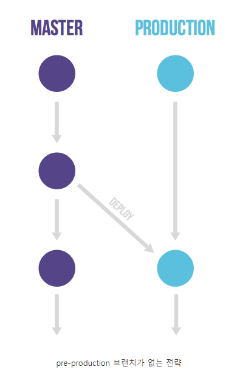
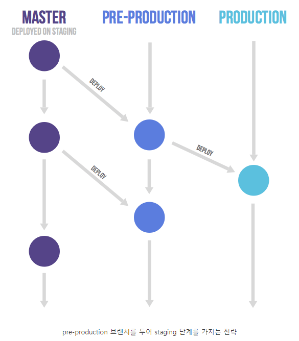

# Gitlab Flow

Gitlab Flow는 Branch 전략으로서 아래와 같이 사용을 한다.

## Branch 설명

### feature

모든 기능 구현은 feature Branch에서 시작한다. feature Branch는 master Branch에서 분기되고 Mergy된다.

### master

gitlab flow의 master Branch 역할은 git flow의 develop Branch와 동일하다. master Branch는 feature Branch에서 병합된 기능에 대해 test를 진행한다. 전체적인 테스트가 진행되어 기능에 대한 보장이 되었다면 production Branch로 Mergy한다.

만약 staging 단계를 원한다면 pre-production Branch로 Mergy를 진행한다.

### production

gitlab flow의 production Branch 역할은 git flow의 master Branch와 동일하다. 테스트가 끝난 기능에 대해 배포를 하기 위한 Branch이다.

### pre-production

master → production Branch 사이에 pre-production Branch를 두어 변경 사항을 바로 production에 배포하지 않고 test server에 배포하여 통합 테스트를 진행하거나 시간을 두고 반영하는 Branch이다.

## 요약

Git flow는 너무 복잡하고 Github flow는 너무 단순하다 라는 요구사항에 나온 전략으로 서비스의 규모가 조금 커진 팀에서 사용하기 좋은 전략인 것 같다
