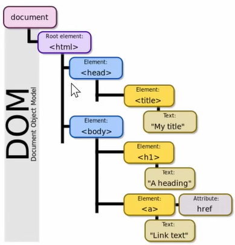
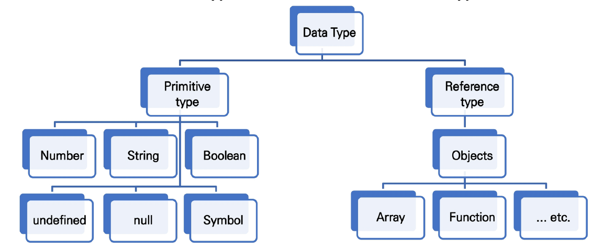
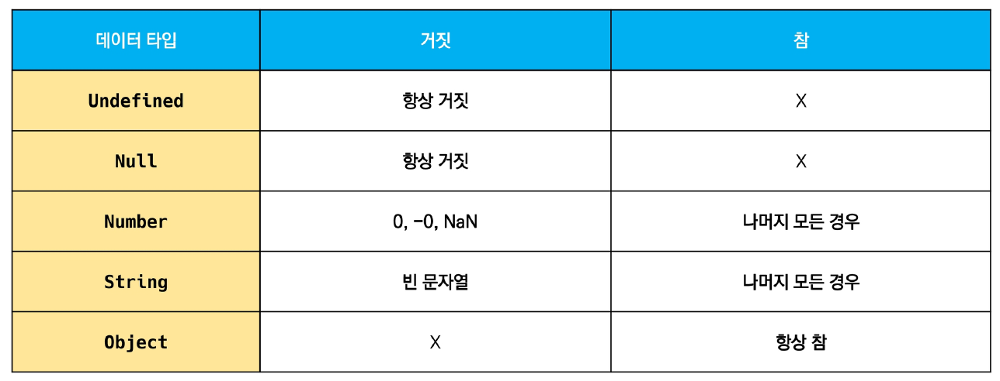
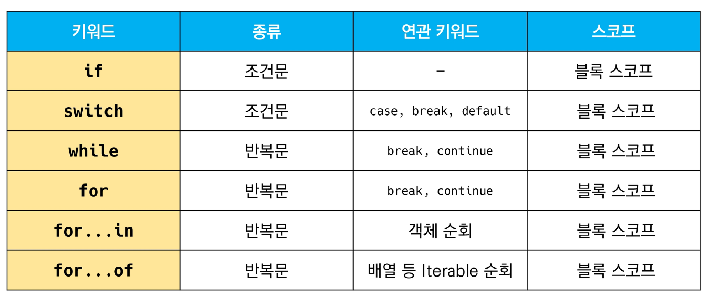

# JavaScript

## JavaScript의 필요성

### JavaScript의 필요성

- Browser 화면을 '동적'으로 만들기 위함
- Browser를 조작할 수 있는 **유일한 언어**

### Browser에서 할 수 있는 일

- DOM(Document Object Model) 조작
  - 문서(HTML) 조작
- BOM(Browser Object Model) 조작
  - navigator, screen, location, frames, history, XHR
- JavaScript Core (ECMAScript)
  - Data Structure(Object, Array), Conditional Expression, Iteration

### DOM?

- HTML, XML과 같은 문서를 다루기 위한 프로그래밍 인터페이스
- 문서를 구조화하고, 구조화된 구성 요소를 하나의 객체로 취급하여 다루는 논리적 트리 모델
- 문서가 객체(object)로 구조화되어 있으며 key로 접근 가능
- 단순한 속성 접근, 메서드 활용뿐만 아니라 프로그래밍 언어적 특성을 활용한 조작 가능
- 주요 객체
  - window: DOM 표현하는 창(브라우저 탭), 최상위 객체(작성 시 생략 가능)
  - document: 페이지 컨텐츠의 Entry Point 역할을 하며, <head>, <body>등과 같은 수많은 다른 요소들을 포함
  - navigator, location, history, screen



### DOM - 해석

- 파싱(Parsing)
  - 구문 분석, 해석
  - 브라우저가 문자열을 해석하여 DOM Tree로 만드는 과정

### BOM?

- Browser Object Model
- 자바스크립트가 브라우저와 소통하기 위한 모델
- 브라우저의 창이나 프레임을 추상화해서 프로그래밍적으로 제어할 수 있도록 제공하는 수단
  - 버튼, URL 입력창, 타이틀 바 등 브라우저 윈도우 및 웹 페이지의 일부분을 제어 가능
- window 객체는 모든 브라우저로부터 지원받으며 브라우저의 창(window)를 지칭

### JavaScript Core

- 브라우저(BOM & DOM)을 조작하기 위한 명령어 약속(언어)

### 정리

브라우저(BOM)과 그 내부의 문서(DOM)를 조작하기 위해 ECMAScript(JS)를 학습


## Introduction

### ECMA?

- ECMA(ECMA International)
  - 정보 통신에 대한 표준을 제정하는 비영리 표준화 기구
- ECMAScript는 ECMA에서 **ECMA-262** 규격에 따라 정의한 언어
  - ECMA-262*: 범용적인 목적의 프로그래밍 언어에 대한 명세
- **ECMAScript6는 ECMA에서 제안하는 6번째 표준 명세를 말함**
  - (참고) ECMAScript6의 발표 연도에 따라 ECMAScript2015라고도 불림

### 세미콜론 (Semicolon)

- 자바스크립트는 세미콜론을 선택적으로 사용 가능
- 세미콜론이 없으면 ASI*에 의해 자동으로 세미콜론이 삽입됨
  - ASI*: 자동 세미콜론 삽입 규칙 (Automatic Semicolon Insertion)
- 나는 **자바스크립트의 문법 및 개념적 측면에 집중하기 위해 세미콜론을 사용하지 않고 진행하겠다!**

### 코딩 스타일 가이드

- 코딩 스타일의 핵심은 **합의된 원칙과 일관성**
  - 절대적인 하나의 정답은 없으며, 상황에 맞게 원칙을 정하고 일관성 있게 사용하는 것이 중요
- 코딩 스타일은 코드의 **품질에 직결되는 중요한 요소**
  - 코드의 가독성, 유지보수 또는 팀원과의 커뮤니케이션 등 **개발 과정 전체에 영향을 끼침**
- (참고) 다양한 자바스크립트 스타일 가이드
  - **Airbnb Javascript Style Guide**
  - Google Javascript Style Guide
  - standardjs


## 변수와 식별자

### 식별자 정의와 특징

- 식별자(Identifier)는 변수를 구분할 수 있는 변수명을 말함
- 식별자는 반드시 문자, 달러($) 또는 밑줄(_)로 시작
- 대소문자를 구분하며, 클래스명 외에는 모두 소문자로 시작
- 예약어 사용 불가능
  - 예약어 예시: for, if, function 등

### 식별자 작성 스타일

- 카멜 케이스(camelCase, lower-camel-case)
  - 변수, 객체, 함수에 사용
- 파스칼 케이스(PascalCase, upper-camel-case)
  - 클래스, 생성자에 사용
- 대문자 스네이크 케이스(SNAKE_CASE)
  - 상수(constant)에 사용
    - 상수의 정의: 개발자의 의도에 상관없이 **변경될 가능성이 없는 값**을 의미

### 변수 선언 키워드(let, const)

- let

  - **재할당 할 예정인** 변수 선언시 사용
  - 변수 **재선언 불가능**
  - 블록 스코프*
- const

  - **재할당 할 예정이 없는** 변수 선언시 사용
  - 변수 **재선언 불가능**
  - 블록 스코프*
- var (지양😰)

  - var로 선언한 변수는 재선언 및 재할당 모두 가능
- ES6 이전에 변수를 선언할 때 사용되던 키워드
  - 호이스팅*되는 특성으로 인해 예기치 못한 문제 발생 가능

    - 따라서 **ES6 이후부터는** var 대신 **const와 let을 사용하는 것을 권장**
- 함수 스코프*

> **(참고) 선언, 할당, 초기화**
>
> - 선언 (Declaration)
>   - **변수를 생성**하는 행위 또는 시점
> - 할당 (Assignment)
>   - **선언된 변수에 값을 저장**하는 행위 또는 시점
> - 초기화 (Initialization)
>   - 선언된 변수에 **처음으로 값을 저장**하는 행위 또는 시점

> **블록 스코프 (block scope)**
>
> - **if, for, 함수** 등의 **중괄호 내부**를 가리킴
> - 블록 스코프를 가지는 변수는 **블록 바깥에서 접근 불가능**

> **호이스팅 (hoisting)**
>
> - 함수 안에 있는 선언들을 모두 끌어올려서 해당 함수 유효 범위의 최상단에 선언하는 것
> - 결과적으로 변수를 선언 이전에 참조할 수 있는 현상
> - 변수 선언 이전의 위치에서 접근 시 undefined를 반환


## 데이터 타입

### 데이터 타입 종류

- 자바스크립트의 모든 값은 **특정한 데이터 타입을 가짐**
- 크게 **원시 타입(Primitive type)**과 **참조 타입(Reference type)**으로 분류됨



### (참고) 원시 타입과 참조 타입 비교

- 원시 타입 (Primitive type)
  - 객체(object)가 아닌 기본 타입
  - 변수에 해당 타입의 값이 담김
  - 다른 변수에 복사할 때 실제 값이 복사됨
- 참조 타입 (Reference type)
  - 객체(object) 타입의 자료형
  - 변수에 해당 객체의 참조 값이 담김
  - 다른 변수에 복사할 때 참조 값이 복사됨

### 원시 타입 (Primitive type)

- 숫자 (Number) 타입
  - **정수, 실수 구분 없는 하나의 숫자 타입**
  - **부동소수점 형식을** 따름
  - (참고) NaN (Not-A-Number)
    - **계산 불가능한 경우** 반환되는 값
- 문자열 (String) 타입
  - **텍스트 데이터를 나타내는 타입**
  - 16비트 유니코드 문자의 집합
  - 작은따옴표 또는 큰따옴표 모두 가능
  - 템플릿 리터럴 (Template Literal)
    - ES6부터 지원
    - 따옴표 대신 backtick(``)으로 표현
    - ${ expression } 형태로 표현식 삽입 가능
- undefined (개발자의 의도가 없는 경우)
  - 빈 값을 표현하기 위한 데이터 타입
  - **변수 선언 시 아무 값도 할당하지 않으면, 자바스크립트가 자동으로 할당**
  - typeof 연산자의 결과는 undefined
- null (개발자의 의도가 있는 경우)
  - 빈 값을 표현하기 위한 데이터 타입
  - **개발자가 의도적으로 필요한 경우 할당**
  - typeof 연산자의 결과는 object
- Boolean 타입
  - **논리적 참 또는 거짓을** 나타내는 타입
  - **true** 또는 **false로** 표현
  - **조건문 또는 반복문\*에서** 유용하게 사용
    - (참고) 조건문 또는 반복문에서 **boolean이 아닌 데이터 타입은** 자동 형변환 규칙에 따라 true 또는 false로 변환됨

### (참고) 자동 형변환 정리

조건문 또는 반복문에서 표현식의 결과가 참/거짓으로 판별되는 경우



## 연산자

### 할당 연산자

- 오른쪽에 있는 피연산자의 평가 결과를 왼쪽 피연산자에 할당하는 연산자
- 다양한 연산에 대한 단축 연산자 지원
- (참고) Increment 및 Decrement 연산자
  - Increment(++): 피연산자의 값을 1 증가시키는 연산자
  - Decrement(--): 피연산자의 값을 1 감소시키는 연산자
  - Airbnb Style Guide에서는 '+='또는 '-='와 같이 더 분명한 표현으로 적을 것을 권장함

### 비교 연산자

- 피연산자들(숫자, 문자, Boolean 등)을 비교하고 결과값을 boolean으로 반환하는 연산자
- 무자열은 유니코드 값을 사용하며 표준 사전 순서를 기반으로 비교
  - ex) 알파벳끼리 비교할 경우
    - 유니코드를 기준으로 비교(대문자<소문자, a<d)

### 동등 비교 연산자(==) (지양😰)

- 두 피연산자가 같은 값으로 평가되는지 비교 후 boolean 값을 반환
- 비교할 때 암묵적 타입 변환을 통해 타입을 일치시킨 후 같은 값인지 비교
- 두 피연산자가 모두 객체일 경우 메모리의 같은 객체를 바라보는지 판별
- **예상치 못한 결과가 발생할 수 있으므로 특별한 경우를 제외하고 사용하지 않음**

### 일치 비교 연산자 (===) (지향😄)

- 두 피연산자가 같은 값으로 평가되는지 비교 후 boolean 값을 반환
- 엄격한 비교*가 이루어지며 암묵적 타입 변환이 발생하지 않음
  - 엄격한 비교*: 두 비교 대상의 타입과 값 모두 같은지 비교하는 방식
- 두 피연산자가 모두 객체일 경우 메모리의 같은 객체를 바라보는지 판별

### 논리 연산자

- 세 가지 논리 연산자로 구성
  - and: '&&'
  - or: '||'
  - not: '!'

### 삼항 연산자(Ternary Operator)

예시

```javascript
const result = Math.PI > 4 ? 'Yes' : 'No'
console.log(result) // No
```

- 세 개의 피연산자를 사용하여 조건에 따라 값을 반환하는 연산자
- 가장 왼쪽의 조건식이 참이면 콜론(:) 앞의 값을 사용하고 그렇지 않으면 콜론(:) 뒤의 값을 사용
- 삼항 연산자의 결과 값이기 때문에 변수에 할당 가능

- (참고)  한 줄에 표기하는 것을 권장


## 조건문

### 조건문의 종류와 특징

- 'if' statement

  - 조건 표현식의 결과값을 **Boolean 타입으로 변환 후 참/거짓을 판단**
  - if, else if, else
    - 조건은 **소괄호(condition)** 안에 작성
    - 실행할 코드는 **중괄호{}** 안에 작성
    - 블록 스코프 생성
  - 'if' statement 예시

  ```javascript
  const nation = 'Korea'
  
  if (nation === 'Korea') {
      console.log('안녕하세요!')
  } else if (nation === 'France') {
      console.log('Bonjour!')
  } else {
      console.log('Hello!')
  }
  ```

- 'switch' statement

  - 조건 표현식의 결과값이 **어느 값(case)에 해당하는지 판별**
  - (참고*) 주로 특정 변수의 값에 따라 조건을 분기할 때 활용
    - 조건이 많아질 경우 if문보다 가독성이 나을 수 있음
  - 'switch' statement 예시

  ```javascript
  const nation = 'Korea'
  
  switch(nation) {
      case 'Korea': {
          console.log('안녕하세요!')
          break
      }
      case 'France': {
          console.log('Bonjour!')
          break
      }
      default: {
          console.log('Hello!')
      }
  }
  ```


## 반복문

### 반복문의 종류와 특징

- while

  while 예시

  ```javascript
  let i = 0
  
  while (i < 6) {
      console.log(i) // 0, 1, 2, 3, 4, 5
  }
  ```

- for

  for 예시

  ```javascript
  const arr = [1, 2, 3]
  
  for (let i=0; i<arr.length; i++) {
      console.log(arr[i])
  }
  ```

- for ... in

  - **객체(object)의 속성(key)들을 순회**할 때 사용
  - 배열도 순회 가능하지만 인덱스 순으로 순회한다는 보장이 없으므로 **권장하지 않음**

  for ... in 예시

  ```javascript
  const capitals = {
      Korea: 'Seoul',
      France: 'Paris',
      USA: 'Washington D.C.'
  }
  
  for (let nation in capitals) {
      console.log(`${nation}의 수도는 ${capitals[nation]}`)
  }
  // Korea의 수도는 Seoul
  // France의 수도는 Paris
  // USA의 수도는 Washington D.C.
  
  // 번외
  console.log(capitals.nation) // undefined
  console.log(capitals.Korea) // Seoul
  ```

- for ... of (오브는 오브(젝)을 안쓴다!)

  - **반복 가능한(iterable) 객체를 순회하며 값을 꺼낼 때 사용**
    - 반복 가능한 객체의 종류: Array, Map, Set, String 등

  for ... of 예시

  ```javascript
  const allStudy = ['권기정', '임재현', '지수경', '한승재']
  
  for (let member of allStudy) {
      member = member + '(이)는 똑똑해'
      console.loge(member)
  }
  // 권기정(이)는 똑똑해
  // 임재현(이)는 똑똑해
  // 지수경(이)는 똑똑해
  // 한승재(이)는 똑똑해
  
  // const
  for (const member in allStudy) {
      // member 재할당 불가
      console.loge(member)
  }
  // 권기정, 임재현, 지수경, 한승재
  
  
  // for ... in
  for (let member in allStudy) {
      console.loge(member)
  }
  // 0, 1, 2, 3
  ```

**for ... of 내부에 'let' vs 'const' 무엇을 쓸까?**

설계가 잘 되어 있다면 let, const 중 무엇을 택 할지 정답은 이미 나와 있을 것이다. 재할당을 해야한다면 let을 쓸 것이고 그렇지 않다면 const를 쓸 것이다. 하지만 나는 아직은 미숙한 개발자이기 때문에 **const를 고정적으로 쓰다가 코드를 짜다가 재할당 할 일이 생기면 let을 쓰도록 하자.** 경험상 for문 안에 해당 변수를 재할당 한 경우는 거의  없었던 것 같다.


## 조건문과 반복문 정리



