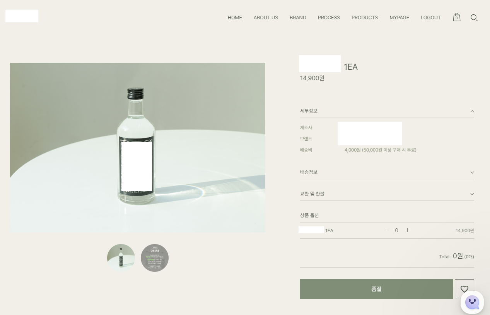
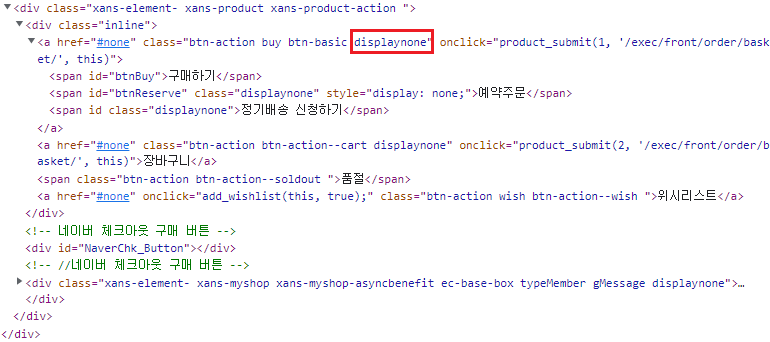
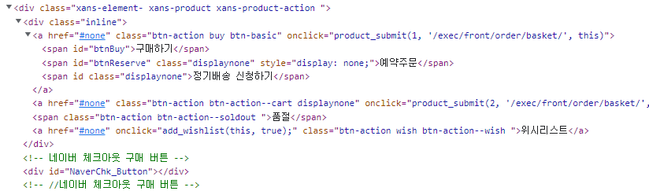
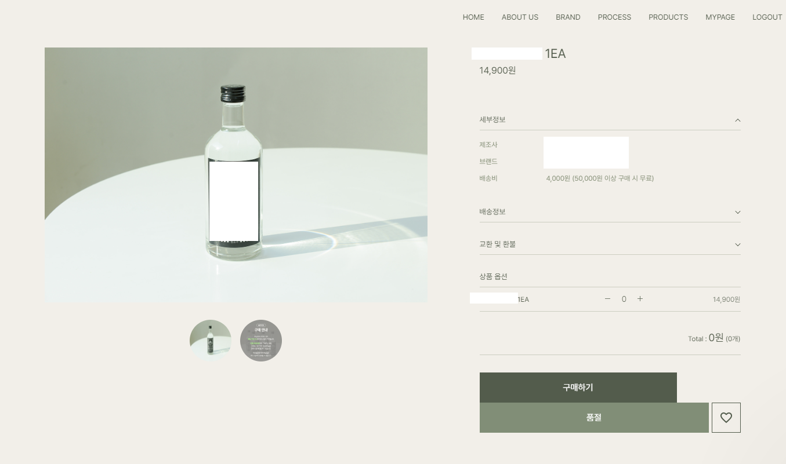

# 간단한 HTML CSS class 조작: 하나소주 구매하기

## 개요

좋아하는 가수 'J-빠끄'가 런칭한 프리미엄 증류 소주 '하나소주'가 온라인 판매를 실시했다. 원칙적으로 우리나라에서 주류는 온라인 판매가 금지돼 있으나 전통주는 특정 조건 하에 허용되고 있다. 전통주와 우리 농산물의 소비를 촉진한다는 취지 때문이다.

하나소주는 전통증류방식을 재현하여 제조 수량이 매우 한정적이다 보니 물량 공급이 원활하지 못하다. 주말, 공휴일을 제외한 영업일 오전 11시에 매일 2000병이 입고되며, 인당 최대 6병을 구매 할 수 있다.

오전 11시 입고 후 1분이 채 안되는 시간에 완판이 되고있으며, 정각에 대기하여 판매 상품 페이지를 새로고침한 결과 상품 구매에 실패했다.

하나소주를 맛보기 위해 간단한 HTML, CSS 조작을 통해 미리 입고된 페이지를 띄워 상품을 구매를 해보자.

## HTML, CSS

### HTML(Hyper Text Markup Language)

HTML은 웹 페이지를 작성, 구조화하기 위한 언어로 참조(하이퍼링크)를 통해 사용자가 한 문서에서 다른 문서로 접근할 수 있다.

### CSS(Cascading Style Sheets)

CSS는 스타일을 지정하기 위한 언어로 선택자를 통해 스타일을 지정할 HTML 요소를 선택하여 스타일을 적용한다.

### 외부 스타일, class 선택자를 이용한 스타일 적용

스타일을 적용하는 방식에는 여러가지가 있지만 생략하자.

보통의 경우 스타일의 일관성과 유지보수의 유용성을 위해 HTML의 head 태그 안에 link 태그를 사용하여 CSS 문서에 연결하고 CSS에 class를 정의하여 HTML에 class를 적용하여 스타일을 반영한다는 점만 알고 있으면 된다.

## 구매하기

### 준비사항

우리의 핵심 과제는 미리 입고된 창을 띄워 상품 구매하는 것이기 때문에 부가적인 아래와 같은 기본적인 준비사항은 알아서 준비해 두자.

- Chrome 브라우저
- 하나소주 온라인 몰 회원가입
- 기본 배송지 입력
- 가상계좌로 송금 할 계좌
- 속 Money

### 웹 페이지 살펴보기

제품 구매 페이지를 확인해보면 현재 품절 상태인 것을 확인 할 수 있다.

여기서 F12 버튼을 눌러 개발자 도구를 활성화 하자.

Elements 탭에서 해당 페이지를 구성하고 있는 문서를 확인 할 수 있다.

우리는 구매하기 버튼을 활성화 시킬 것이다.

Elements 탭에서 Ctrl + f 를 눌러 '구매하기'를 검색해보면 아래와 같은 코드를 확일 할 수 있다.

빨간 박스를 살펴보자 구매하기, 예약주문, 정기배송 신청하기 버튼이 displaynone 클래스로 숨겨져 있는 것을 확인 할 수 있다.

우리는 이제 displaynone 만 지워주면 구매하기 버튼을 활성화 시킬 수 있는 것이다.

위와 같이 코드를 수정했다면 페이지는 아래와 같이 바뀐 것을 확인 할 수 있다.

구매하기 버튼이 생성됐다.

이제부터는 간단하다. 상품의 수량(6개 이하)을 설정하고 제품이 입고되는 11시 1분전 부터 구매하기 버튼을 광클하면 된다. 남들이 구매하기 버튼이 활성화된 페이지를 로드받는 동안 우리는 한발 먼저 구매하기 요청을 보낼 수 있다.

이후 중요한 부분은 반드시 **무통장 입금**을 이용하도록 하자 무통장 입금이 가장 빠르게 상품 주문을 할 수 있다. 주문에 성공하면 여유롭게 입금하면 된다.

하나소주 맛있게 드세요 ^^
전통주 화이팅!

J-빠끄 화이팅!
